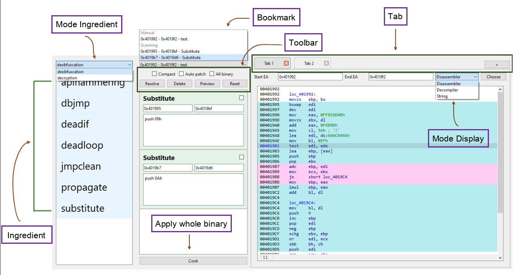
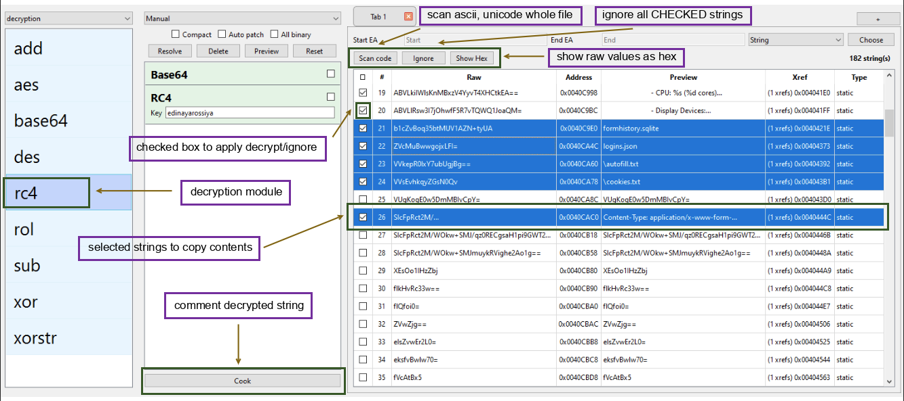
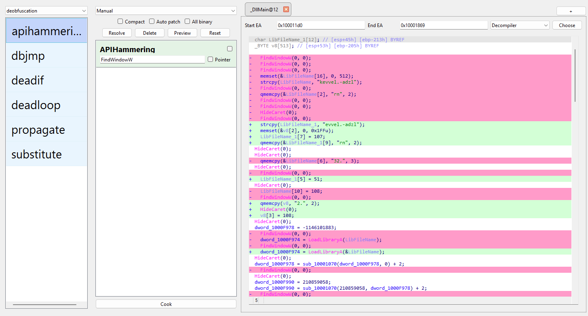
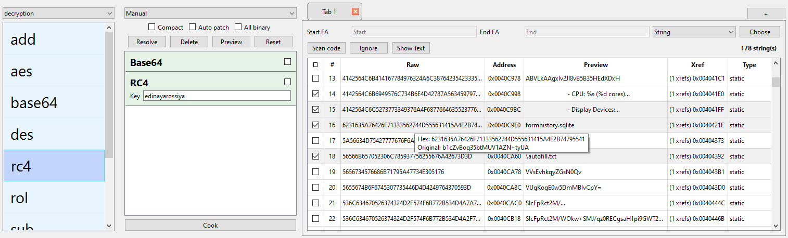

# Sharingan IDA Plugin

Assist IDA users with deobfuscation and string/data decryption through a drag-and-drop recipe workflow. Plugin was developed to streamline the reverse engineering workflow by bridging the gap between complex obfuscation and encrypted string through two core strategies:

- **Automation**

  - Clean up code without the headache: It automatically handles common obfuscation patterns for you. If you run into something new, you can easily plug in your own custom module to deal with it.
  - Stop chasing encoded strings: Instead of decrypting strings one by one, let the plugin find and decode them for you. It even drops the results directly into IDA comments so you’re never out of the loop.

* **Visualization**

  - See exactly what changed: No more guessing—Sharingan highlights the "before" and "after" so you can see exactly how the code was cleaned up at a glance.
  - Mix and match your modules: Think of each module as a layer. You can toggle them on or off to see how different deobfuscation steps affect the code without committing to anything.
  - Never lose your place: It uses clear color-coding for obfuscated areas, making it much easier to keep you navigate even in massive, messy binaries.

## Features

- **Easy UI**: Borrowed the drag-and-drop idea from CyberChef to keep things smooth and simple.
- **Dual mode pipeline**: switch between deobfuscation and decryption.
- **Built-in ingredients**: deobfuscators (`apihammering`, `dbjmp`, `deadif`, `deadloop`, `propagate`, `substitute`) and decryptors (`aes`, `rc4`, `xor`, `xorstr`, `base64`, `add`, `des`, `rol`, `sub`).
- **Bookmark-driven ranges**: add manual or scanned ranges to process; focusing on small code-block before apply those deobfucation methods to whole binary.
- **Highlight difference**: review assembly or decompiler diffs in the after committing changes; compact mode hides the disassembler pane when space is tight.
- **Right-click helpers**: from IDA’s disassembly view quickly Select a range to deobfuscate, Exclude (revert) a patch, or Filter to inject a substitute module.
- **Hints and overlap detection**: colorize found obfuscated regions by modules to focus results; overlapping obfuscated regions are highlighted for quick triage.
- **String finding**: Find all available string from static strings, stack strings, tight strings base-on ascii and unicode pattern.
- **String decryption**: Select potential encrypted strings to apply desired decryption methods. Preview it before comment results in strings' addresses.

## Requirements

- IDA Pro 9.x with Hex-Rays installed (pseudocode preview relies on `ida_hexrays`).
- Install Python 3.12 or later and all packages in requirements.txt

## Usage

1. Launch via `Alt+F9` or `Edit → Plugins → Sharingan`.
2. In **Operation**, choose the mode (Deobfuscation/Decryption) and drag-and-drop ingredients into **Recipe**.

### Deobfuscation

1. Select a range in IDA and use the disassembly right-click menu to **Bookmark** it (or **Filter** to add a substitute; **Exclude** to revert a false positive). Bookmarks appear in the combo box and are persisted per-IDB. In additional to, selecting mode display to switch view assembly/decompiler/string.
2. Toggle options in **Recipe**:
   - `Compact`: hide the disassembler/decompiler pane for side-by-side layouts.
   - `Auto patch`: apply patches automatically when preview.
   - `All binary`: operate on the entire binary instead of a selection.
3. Click **Preview** to show the found obfuscated regions in the docked `asm_view` (ASM or Hex-Rays). Use **Reset** to clear scanning entries; **Delete** to remove ingredients from the recipe; **Resolve** to mark selected region from Bookmark as done and delete it. After ensuring the found regions are corrent, use **Cook** to apply patches and display changes before/after.
4. Each tab represents a region. There is a button new tab to handle many different regions.

### Decryption

1. Press **SCAN CODE** to scan all ascii/unicode from static strings of IDA strings, stack strings/tigh strings from function emulator (All of them go through some filters before showing).
2. Select garbage strings by `CHECK` on rows, then press **IGNORE** to blacklist them (will be filtered later on).
    > If you want to undo it, remove them from *%IDAdir%\plugins\sharingan\sharingan\core\StrFinder\ignore_string* or *%APPDATA%\Roaming\Hex-Rays\IDA Pro\plugins\sharingan\core\StrFinder\ignore_string*
3. Select potential strings by `CHECK` on rows.
4. Drag decryptors into **Recipe**.
5. Then press **PREVIEW** to decrypt all of them sequentially and show values at **preview** columns.
6. Click **COOK** to decrypt all of `CHECKED` strings and `COMMENT` the preview to its address and xrefs. 
7. You can **SHOW HEX** to see value as hex value.
8. You can select multiple rows and copy them as table to process them by your self. (not affected to `CHECKED` strings)

## Technique Details

### Deobfuscation

- `APIHammering`: 32-bit only; locates dummy WinAPI and NOPs the call plus its argument pushes.
- `DBJmp`: finds stacked JMPs that land on the same target, rewrites them into a single branch, and cleans overlapping junk bytes.
- `DeadIf`: uses Hex-Rays to spot constant numeric IF conditions; NOPs the compare/jump pair and the unreachable then/else blocks.
- `DeadLoop`: Hex-Rays-driven scan for constant-condition loops; strips loop blocks to remove dead control flow. Only support remove loop body currently.
- `Propagate`: emulates indirect jmp/call chains with Unicorn to recover real targets and drops a comment with the resolved address.
- `Substitute`: user-provided start/end and replacement assembly; searches matching byte patterns in-range, assembles the patch, and pads with NOP as needed.

### Decryption

- Byte ops: `Xor`, `XorStr` (repeating key), `Add`, `Sub`, `Rol` (byte-wise rotate).
- Ciphers: `RC4`, `AES` (ECB/CBC with IV), `DES` (ECB/CBC); keys/IVs are padded or truncated to valid sizes.
- Encoding: `Base64` with automatic padding fixups for truncated inputs.

## Acknowledgement
Special thanks to the following projects whose inspiring us about ideas and tooling partially shaped Sharingan:

- [**FLOSS**](https://github.com/mandiant/flare-floss): for pioneering robust string deobfuscation, stack string extraction, and plugin workflow design in IDA. Several stack-string and API-likeness heuristics in Sharingan are derived or adapted from its methodology.
- [**CyberChef**](https://gchq.github.io/CyberChef): for inspiring the visual, recipe-based approach to transform and decode data in a modular "drag-and-drop" pipeline. Sharingan borrows from CyberChef's UX concept for mix-and-match operations (especially in string decryption and byte encoding).
- [**Patching**](https://github.com/gaasedelen/patching): for building custom UI and learning how to use some IDAPython apis.

Their innovation and openness are deeply appreciated.
